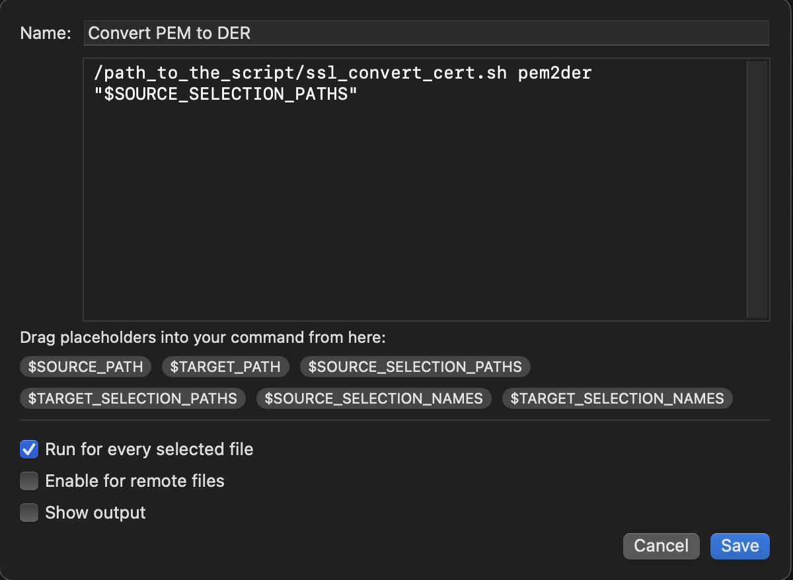

# forklift_x509_tools

Simple shell scripts allowing for displaying and conversion of X.509 certificate / private key files in Forklift via Quick Open.

## List of scripts

- **ssl_display_cert.sh**: displaying details of DER/PEM/CRT/CER/P12/PFX/P7B certificate files
- **ssl_display_pkey.sh**: displaying details of RSA/EC DER/PEM/P12/PFX private key files
- **ssl_display_csr.sh**:  displaying details of CSR files
- **ssl_convert_cert.sh**: converting between different certificate formats and also allowing to split PEM file containing multiple certs into separate PEM files

## Requirements

The scripts require Binarynights [Forklift 4.x](https://binarynights.com) file manager, *openssl* binary and GNU version of *sed*+*awk* which can be installed via [brew](https://brew.sh):

```
brew install gnu-sed gawk
```

The scripts can also be used as standalone shell scripts without Forklift. It should work under any macOS/Linux/Unix.

## Installation

Copy the scripts to the directory of choice, add executable rights:

```
chmod a+x ssl_display_cert.sh  ssl_display_csr.sh ssl_display_pkey.sh ssl_convert_cert.sh
```

## Configuration

Change *sed* and *awk* binary paths in every script (in case they are different).

Then create a new Forklift tool for every script via 'Commands' -> 'Manage Tools'. 

<p align="center">
   
</p>

For some scripts select *'Show output'* option (when something is being displayed), for others it is useful to have it disabled, but enabling the option *'Run for every selected file'* (for example file conversion).

Type the default password in case of encrypted files as Forklift does not allow to get input from the user (however if you use it as standalone script you can type it as command line argument or the script will ask for the password in case it is missing).

That's it, now if you press keyboard shortcut for Quick Open (Esc by default) you will have the option to handle your X.509 files directly from Forklift interface.

## List of the tools

List of some of the tools I defined for myself using the scripts:

- **Display PEM/DER/P12/PFX cert**

*/path_to_the_script/ssl_display_cert.sh "$SOURCE_SELECTION_PATHS" "your_default_password"*

select *'Show output'*

- **Display PEM/DER CSR**

*/path_to_the_script/ssl_display_csr.sh "$SOURCE_SELECTION_PATHS"*

select *'Show output'*

- **Display RSA private key**

*/path_to_the_script/ssl_display_pkey.sh RSA  "$SOURCE_SELECTION_PATHS" "your_default_password"*

select *'Show output'*

- **Display EC private key**

*/path_to_the_script/ssl_display_pkey.sh EC  "$SOURCE_SELECTION_PATHS" "your_default_password"*

select *'Show output'*

- **Convert PEM to DER**

*/path_to_the_script/ssl_convert_cert.sh pem2der "$SOURCE_SELECTION_PATHS"*

select *'Run for every selected file'*

- **Convert DER to PEM**

*/path_to_the_script/ssl_convert_cert.sh der2pem "$SOURCE_SELECTION_PATHS"*

select *'Run for every selected file'*

- **Convert P12 to PEM**

*/path_to_the_script/ssl_convert_cert.sh p12 "$SOURCE_SELECTION_PATHS" "your_default_password"*

select *'Run for every selected file'*

- **Split PEM**

*/path_to_the_script/ssl_convert_cert.sh split-pem "$SOURCE_SELECTION_PATHS"*

select *'Run for every selected file'*

## License

This project is licensed under the GPLv3 - see the [LICENSE](LICENSE) file for details
